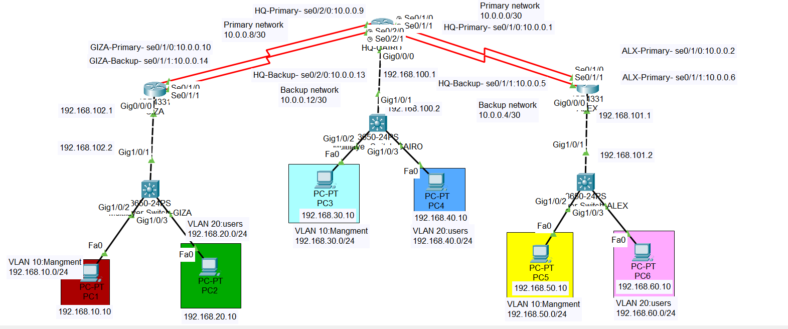

### TechLink Solutions – Network Automation Project

Vodafone Technical Assessment – Transport Capacity Planning Engineer

                  ## Network Topology
                  

### Project Overview

This project demonstrates the design and implementation of a resilient multi-branch enterprise network using Cisco Packet Tracer and Python-based automation.

The network consists of:

* HQ-Cairo

* Alexandria Branch

* Giza Branch

### Features

* Layer 3 Switching

* VLAN Segmentation (Management & Users)

* Static Routing

* Floating Static Routes

* WAN Redundancy

* Automatic Failover Simulation

* Python-Based Network Monitoring

* Timestamped Logging

### Technologies Used

* Cisco Packet Tracer

* Python 3

* JSON

* Static Routing

* Layer 3 Switching

* VLANs

* Network Automation

### Project Structure

network_automation.py # Main automation script network_status.json # Network status simulation automation_log.txt # Generated logs TechLink_Network_Design.pdf TechLink_Vodafone_Presentation.pptx

### Automation Workflow

* Read network status from JSON

* Check primary WAN links

* Detect failures

* Activate backup routes

* Apply configuration changes

* Generate logs

* Produce final routing summary

### Sample Output

Site : Alexandria Primary Link Status : DOWN Backup Link Found Activating Backup Route... Configuration Applied Successfully Current Route : BACKUP

### Author

Omar Magdy Shawky
CCNA | Network & Automation Enthusiast

CCNA | Network & Automation Enthusiast
